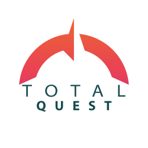
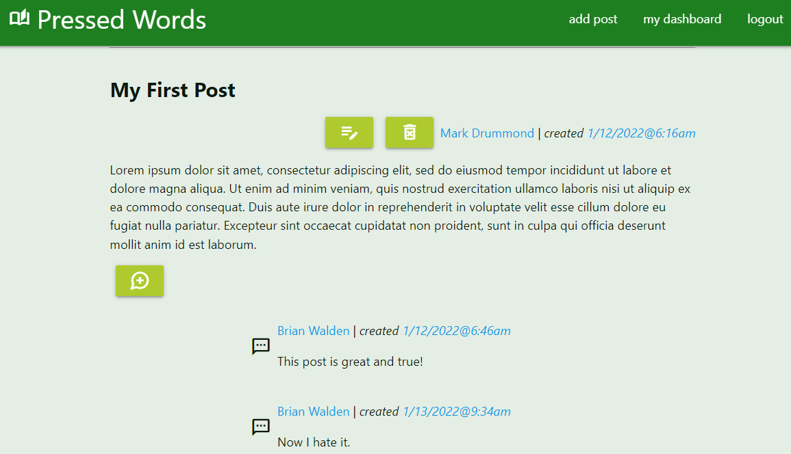

# Mark Drummond, ✨Full Stack Web Developer✨

## Web Developer for Hire
I'm a full stack web developer with independent, freelance, and team development experience. I've created single-page apps, mobile-responsive web apps, WordPress sites, Drupal sites, full-stack React apps with the MERN stack with GraphQL, and full-stack PHP MVC CMSs for clients big and small.

I have been passionate about web development since I was a teenager. I began teaching myself to code when I was 15 and was proficient in C, Bash, HTML, CSS, PHP & MySQL by the time I graduated high school. In college, I took on a few small clients and worked as a web developer at two small businesses. When I moved to Seattle, I established a career in and passion for public health but always missed the creativity and problem solving of web development. As soon as I had the resources, I pursued a certificate in full stack web development through the University of Washington. Now that I’ve earned the certificate, I am excited to pursue this career again. I am seeking employment as a front end, back end, or full stack web developer and look forward to working with you. Please view [my portfolio](http://www.markdrummond.me) (last updated December 2022) for examples of my past and current projects. I look forward to working with you!

## About Me
I researched and procured components to build a PC from scratch when I was 14. I taught myself Debian Linux system administration on the command line, then began teaching myself to code. I then taught myself Apache configuration and ran a web and email server out of my bedroom in my parents' house. I learned HTML, CSS, a little JavaScript, and a lot of PHP from tutorials before YouTube was created. I tested myself by building a website that was basically Facebook before Facebook was created. My friends and I would post updates and comment on each other's posts. It supported infinitely-nested comments, image uploads, and user profiles.

During university, I took on a few small clients, contracted with a development firm, and worked at two small businesses as a web developer. I graduated and fell out of the development field to pursue other passions. Now I've earned a certificate in full stack web development through the University of Washington and am _very_ excited to pursue this career again.

I am seeking employment as a web developer – front end, back end, or full stack. Contact me today to discuss your next website!

## Currently Working On...
### [Total Quest](https://www.totalquest.us)
\
I developed Total Quest as a member of a development team as the final project for my full stack web development certificate program through the University of Washington. I came up with the idea and successfully pitched it to my team, even though it was much more involved than was required by the project. We developed the web app with the MERN (MongoDB, Express, React, & Node) stack using the Material UI library and GraphQL. We were the only group of students to deploy their project to a branded domain.

> Total Quest is an interactive web app in which users complete scavenger hunts by solving clues. When they find the item or location, the user finds a QR code which, when scanned, directs the user to the app which earns them points and celebrates their victories with confetti!
>
> Users can create an account on the web app to start playing! They can choose a scavenger hunt in their city and view all its locations. They can choose a location to view a clue and spend points to get more clues.
>
> Users can be elevated to organizers so they can create their own scavenger hunts with however many items/locations they wish.
>
> Finally, website administrators can create badges that can be awarded when an item/location is found or a scavenger hunt is completed.

My contributions included setting up the the Mongo database; writing Mongoose ODM models; and writing GraphQL typedefs, queries, and mutations in the back end. I took care to write custom queries and mutations that would simplify the front end development. I also wrote the React code for the entire front-end administrator panel which allows for CRUD (Create, Read, Update, and Delete) operations on the four data types: Users, Scavenger Hunts, Hunt Items, and Badges. I also deployed the GitHub repo to Heroku, purchased the domain name, set up the DNS to work with Heroku, and configured the TLS encryption via the [Let's Encrypt](https://letsencrypt.org/) certificate authority.

- 👯 Version 1.0 was released on Mar. 5th, 2022.
- 🌱 Development is ongoing to build on our success.

---

### [Pressed Words](http://blog.markdrummond.me/)

I developed a blogging web app using Node, Express, Handlebars, jQuery, Materialize, and MySQL. Visitors can register as users to start pressing words!

> _Press words_\
>_Squeeze thoughts_

Pressed Words is a work in progress, but it has full functionality and guards against Javascript code injection and SQL injection.

- 👯 Version 1.0 was released on Jan. 22nd, 2022.

---

### [TuneSpace](https://mjamesd.github.io/crispy-happiness/)

I developed TuneSpace in a team setting in my full stack web development certificate program through the University of Washington. We used multiple APIs to gather information into one place and display it in an easy-to-use website.

>We all love music. Music is an expression of culture. It tells stories, stirs emotions, and shares ideas of society. It defines our lives and brings communities together. That’s what we intend to do here: bring people together in one place with music.
>
> _Enter TuneSpace_
>
>_A place for fans. A place for music._
>
>TuneSpace has been created as a guide, a central hub, where people from all over the world can come together and explore their favorite artists or discover their new musical obsession.  Building a community for everyone that loves music. TuneSpace provides a wealth of information that the community can explore. Full artist biographies, discographies, informative deep dives about your favorite songs including lyrics and videos.
>Exploring. Sharing. Interacting. TuneSpace wants you to be part of our community.

My contributions included research APIs by reading their documentation, writing vanilla Javascript code to fetch and display the information from the APIs, and integrating Materialize JS & CSS into the website.
- 👯 Version 1.0 was released on Oct. 30th, 2021.

## Currently Learning...
 🎉 I recently completed a full stack web development certificate program through the University of Washington. I earned an A+ grade.

📚 I am now independently learning more about React, teaching myself TypeScript, and reviewing coding algorithms in Javascript.

## Note
Some of my projects are attributed to "DrumDev". This is my development handle and is not a company, Ltd, LLC, or any legal entity whatsoever.
